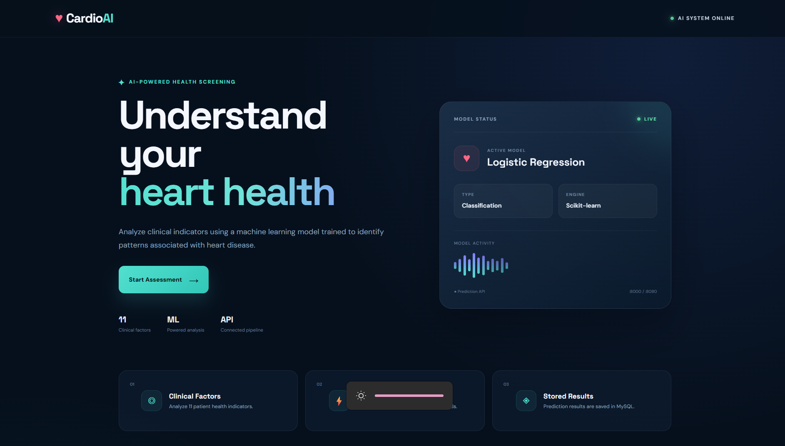
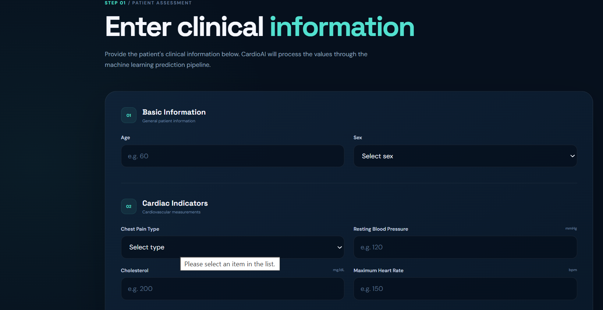
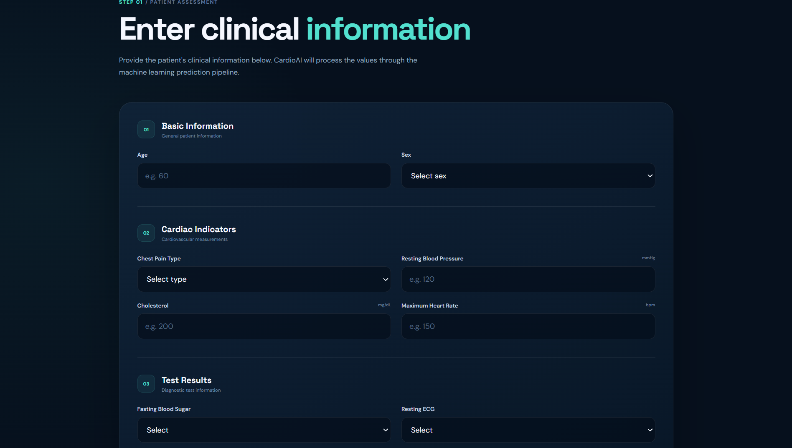
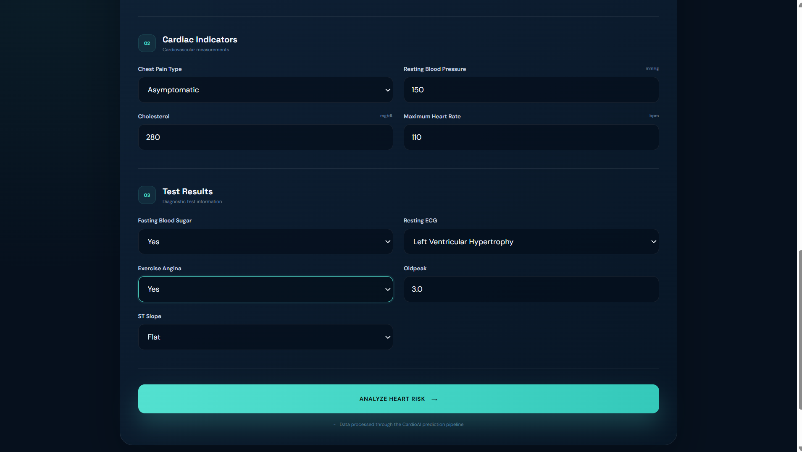
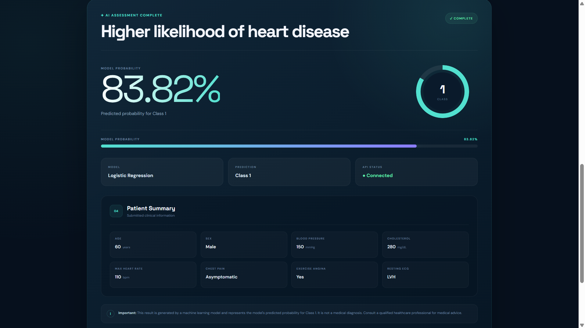
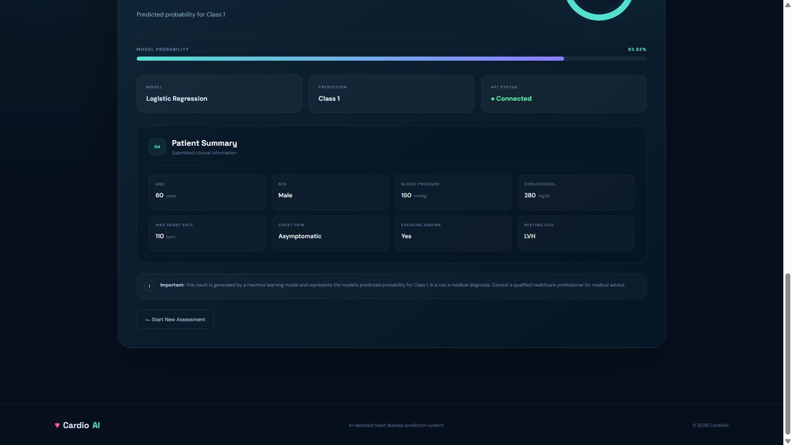

# ❤️ CardioAI — Heart Disease Prediction System

CardioAI is an end-to-end machine learning application that predicts the likelihood of heart disease from selected clinical indicators.

The project combines a **Scikit-learn Logistic Regression model**, **FastAPI**, **Spring Boot**, **MySQL**, and a polished **React + Vite** frontend into one prediction pipeline.

> **Medical disclaimer:** CardioAI is an educational machine-learning project. The displayed probability is the model's predicted probability for Class 1 and is **not a medical diagnosis** or a clinically validated individual risk assessment.

---

## ✨ Features

- 🧠 Logistic Regression heart-disease classification model
- ⚡ FastAPI ML prediction service
- ☕ Spring Boot REST backend
- 🗄️ MySQL database for storing prediction records
- ⚛️ React + Vite frontend
- 🔗 React → Spring Boot → FastAPI → ML model pipeline
- 📊 Model probability and prediction result display
- 👤 Patient input summary on the result screen
- 📱 Responsive dark-themed health analytics interface
- 🔐 Environment variables used for database credentials

---

## 🏗️ System Architecture

```text
                    ┌──────────────────────┐
                    │     React Frontend   │
                    │      Vite + CSS      │
                    └──────────┬───────────┘
                               │
                               │ REST API
                               ▼
                    ┌──────────────────────┐
                    │   Spring Boot API    │
                    │      Java 21         │
                    └───────┬───────┬──────┘
                            │       │
                  Prediction│       │Save result
                            │       │
                            ▼       ▼
                 ┌──────────────┐ ┌──────────────┐
                 │ FastAPI ML   │ │    MySQL     │
                 │   Service    │ │   Database   │
                 └──────┬───────┘ └──────────────┘
                        │
                        ▼
               ┌──────────────────┐
               │ Logistic         │
               │ Regression Model │
               │   Scikit-learn   │
               └──────────────────┘
```

---

## 🧰 Tech Stack

| Layer | Technology |
|---|---|
| Frontend | React, Vite, CSS |
| Backend | Java, Spring Boot |
| ML API | Python, FastAPI |
| Machine Learning | Scikit-learn |
| Data Processing | Pandas |
| Model Serialization | Joblib |
| Database | MySQL |
| API Communication | REST / JSON |
| Build Tools | Maven, npm |
| Version Control | Git, GitHub |

---

## 🧠 Machine Learning

The project uses a **Logistic Regression** classifier trained on a heart disease dataset.

### Input Features

The prediction pipeline uses 11 clinical inputs:

- Age
- Sex
- Chest Pain Type
- Resting Blood Pressure
- Cholesterol
- Fasting Blood Sugar
- Resting ECG
- Maximum Heart Rate
- Exercise-Induced Angina
- Oldpeak
- ST Slope

### Model Comparison

The evaluated models included:

| Model | Accuracy | F1 Score |
|---|---:|---:|
| Logistic Regression | **86.96%** | **0.8846** |
| KNN | 86.41% | 0.8815 |
| Naive Bayes | 84.78% | 0.8614 |
| Decision Tree | 81.52% | 0.8317 |
| SVM | 84.78% | 0.8667 |

Logistic Regression was selected for the final application.

---

## 📂 Project Structure

```text
Heart-Disease-Prediction/
│
├── backend/
│   ├── src/
│   │   └── main/
│   │       ├── java/
│   │       └── resources/
│   ├── pom.xml
│   └── mvnw.cmd
│
├── frontend/
│   ├── src/
│   │   ├── App.jsx
│   │   ├── App.css
│   │   └── main.jsx
│   ├── package.json
│   └── vite.config.js
│
├── ml-service/
│   ├── main.py
│   ├── LogisticRegression_heart.pkl
│   ├── scaler.pkl
│   ├── columns.pkl
│   └── requirements.txt
│
├── notebooks/
│   └── heart_disease_analysis.ipynb
│
├── app.py
├── .gitignore
└── README.md
```

---

## 🔄 Prediction Flow

1. User enters clinical information in the React interface.
2. React sends the patient data to the Spring Boot API.
3. Spring Boot forwards the prediction request to FastAPI.
4. FastAPI prepares the input using the saved feature-column structure and scaler.
5. The Logistic Regression model generates the prediction and Class 1 probability.
6. FastAPI returns the result to Spring Boot.
7. Spring Boot stores the prediction in MySQL.
8. Spring Boot returns the response to React.
9. React displays the prediction, model probability, and patient summary.

---

## 🚀 Running Locally

### 1. Start the ML service

```bash
cd ml-service
py -3.14 -m pip install -r requirements.txt
py -3.14 -m uvicorn main:app --reload
```

FastAPI runs at:

```text
http://127.0.0.1:8000
```

---

### 2. Start MySQL

Create the database:

```sql
CREATE DATABASE heart_disease_db;
```

The Spring Boot application reads the database configuration from environment variables:

```text
DB_URL
DB_USERNAME
DB_PASSWORD
```

---

### 3. Start Spring Boot

From the `backend` directory:

```powershell
$env:DB_URL="jdbc:mysql://localhost:3306/heart_disease_db"
$env:DB_USERNAME="your_username"
$env:DB_PASSWORD="your_password"

.\mvnw.cmd spring-boot:run
```

The backend runs at:

```text
http://localhost:8080
```

---

### 4. Start React

From the `frontend` directory:

```bash
npm install
npm run dev
```

The frontend runs at:

```text
http://localhost:5173
```

---

## 🔌 API

### Prediction Endpoint

```text
POST /api/predictions/predict
```

Example request:

```json
{
  "age": 60,
  "sex": "M",
  "chest_pain": "ASY",
  "resting_bp": 150,
  "cholesterol": 280,
  "fasting_bs": 1,
  "resting_ecg": "LVH",
  "max_hr": 110,
  "exercise_angina": "Y",
  "oldpeak": 3.0,
  "st_slope": "Flat"
}
```

Example response:

```json
{
  "prediction": 1,
  "probability": 83.82
}
```

---

## 🖥️ Application Screenshots

### Home / Landing Page



### Patient Assessment



### Clinical Information Form



### Completed Assessment



### Prediction Result



### Patient Summary



---

## 📌 Current Status

The application has been tested end-to-end locally:

```text
React
  ↓
Spring Boot
  ↓
FastAPI
  ↓
Logistic Regression
  ↓
Spring Boot
  ↓
MySQL
  ↓
React result screen
```

The project is currently available as a GitHub repository and is structured for further cloud deployment.

---

## 🔮 Future Scope

Possible future improvements include:

- Cloud deployment
- Model monitoring
- Model explainability
- Authentication
- Prediction history and analytics
- Automated CI/CD
- Improved validation and clinical evaluation

---

## 👩‍💻 Author

**Sweta Singh**

B.Tech CSE (AI) Student

GitHub: [@swetasingh2004](https://github.com/swetasingh2004)

---

## ⚠️ Disclaimer

This project is developed for educational and portfolio purposes. It should not be used to diagnose, treat, or make medical decisions. The model's output represents a machine-learning prediction and not professional medical advice.
